

## Introduction

- Hello, I'm **Rayder**, a student aspiring to become a Data Scientist, with a strong interest in the rapidly evolving world of Artificial Intelligence.
- My background is primarily self-taught, supported by structured courses that helped establish a solid technical foundation.
- Currently exploring **KSoR** and **Flutter**, because broadening one’s tooling ecosystem tends to accelerate both capability and confusion in equal measure.

## Stack

Grouped by category. Icons include hover titles for anyone unfamiliar with their more abstract logos.

&nbsp;&nbsp;

&nbsp;&nbsp;

&nbsp;&nbsp;

&nbsp;&nbsp;
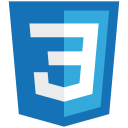

&nbsp;&nbsp;

&nbsp;&nbsp;

&nbsp;&nbsp;

&nbsp;&nbsp;

&nbsp;&nbsp;

&nbsp;&nbsp;

&nbsp;&nbsp;

&nbsp;&nbsp;
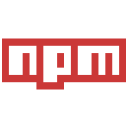

&nbsp;&nbsp;
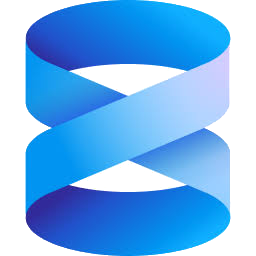
&nbsp;&nbsp;

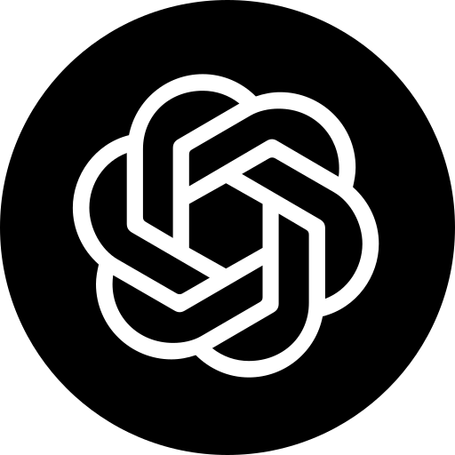
&nbsp;&nbsp;
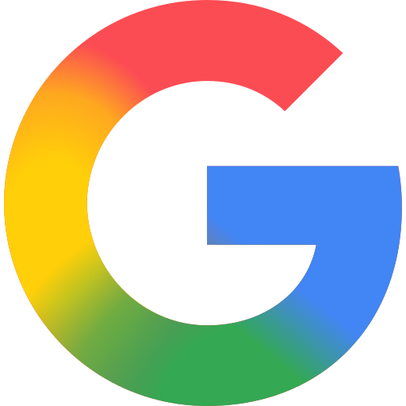
&nbsp;&nbsp;

&nbsp;&nbsp;
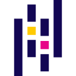
&nbsp;&nbsp;
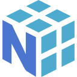
&nbsp;&nbsp;
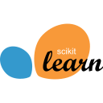
&nbsp;&nbsp;
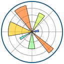
&nbsp;&nbsp;
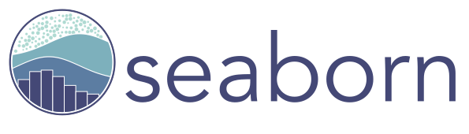

 

&nbsp;&nbsp;

&nbsp;&nbsp;

&nbsp;&nbsp;

&nbsp;&nbsp;
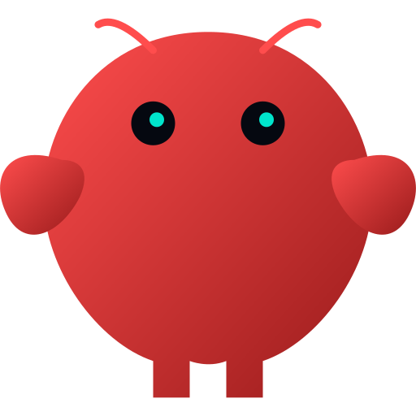

&nbsp;&nbsp;
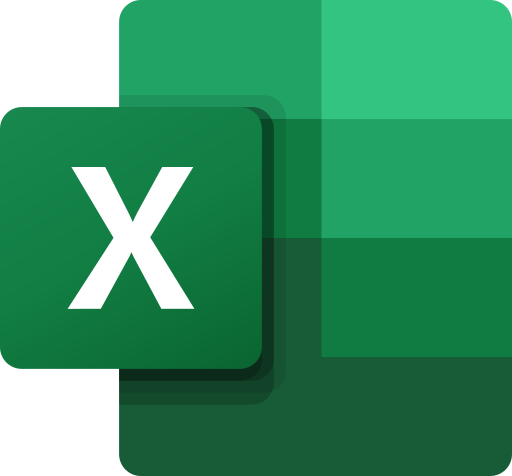
&nbsp;&nbsp;
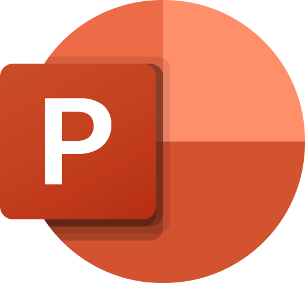

## Published Work

**Sahulat Ghar Tak** — Flutter app, published on both stores.

<a href="https://apps.apple.com/pk/app/sahulat-ghar-tak/id6810184599">
  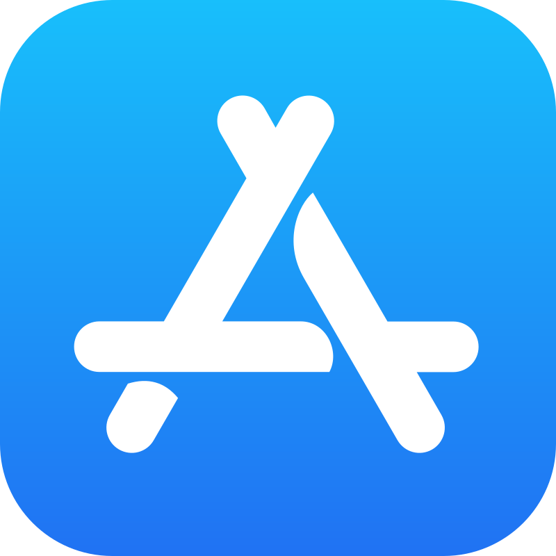
</a>
&nbsp;&nbsp;

## Contact

<a href="mailto:mclarenraider@gmail.com">
  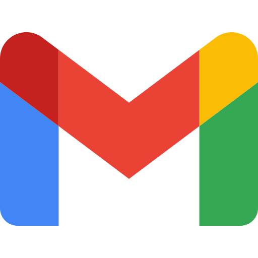
</a>
&nbsp;&nbsp;

